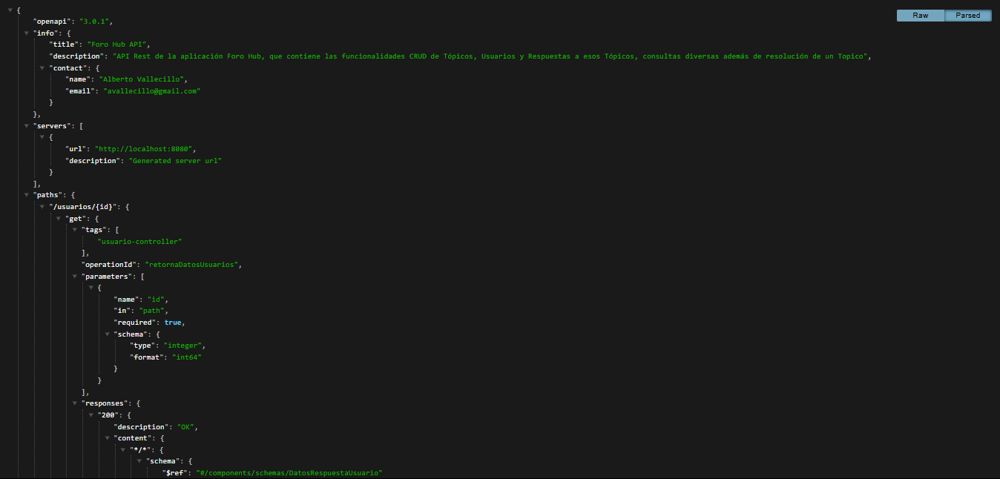
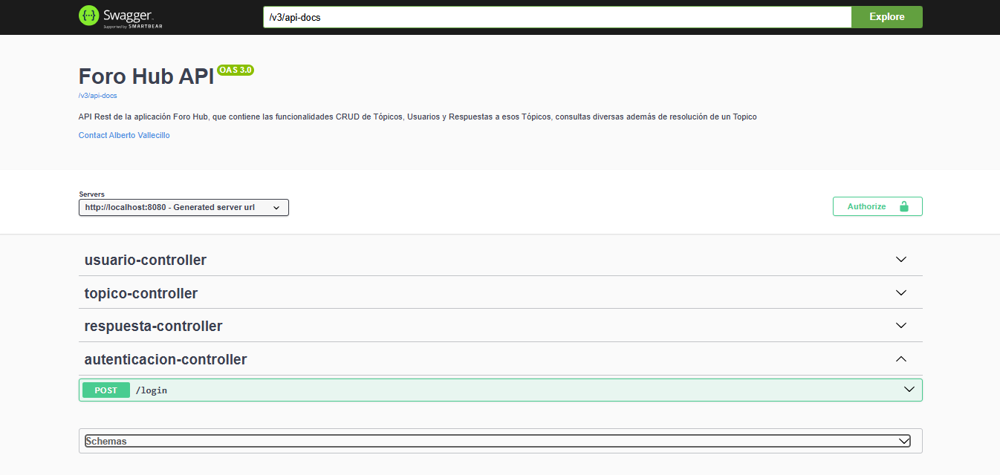
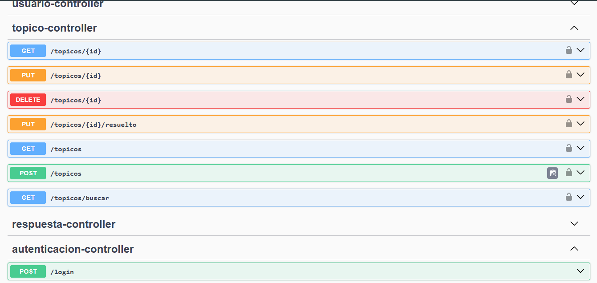
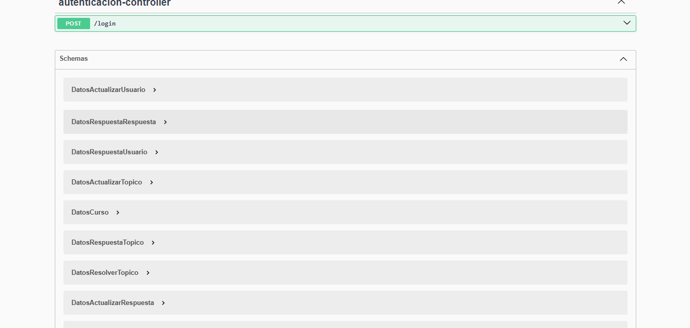

<h1 align="center">💻Foro Hub💻</h1>

**Foro Hub** es un desarrollo de un Foro, donde todos los participantes de una plataforma pueden colocar sus preguntas sobre determinados asuntos,
 se crea una API REST usando Spring, tiene validaciones según reglas de negocio, implementación de una Base de Datos MySQL para la persistencia de
información y Servicio de Autenticación/Autorización, finalmente se documenta con Swagger.

<p align="center">

</p>

## 💽Insignia Challenge Foro Hub
El programa **ONE Oracle Next Education** junto con la academa **Alura Latam** otorgan una insignia a quienes finalizan este Challenge.
<p align="center">

</p>
<p align="center">


</p>

---

## 📑Índice

1. [Descripción del Proyecto](#descripción-del-proyecto)
2. [Funcionalidades](#funcionalidades)
3. [Acceso al Proyecto](#acceso-al-proyecto)
4. [Tecnologías Utilizadas](#tecnologías-utilizadas)
5. [Desarrollador](#desarrollador)

---

## 📝Descripción del Proyecto

Foro Hub es una API REST que simula el backend de un foro donde los usuarios pueden interactuar creando y gestionando tópicos de discusión. Inspirada en la dinámica de los foros educativos, esta API permite realizar las operaciones CRUD necesarias para administrar los usuarios, tópicos y respuestas a esos tópicos,  promoviendo la colaboración y el aprendizaje.

Este proyecto se desarrolló como parte del Challenge Back End de Alura, aplicando las mejores prácticas en desarrollo de software y diseño de APIs REST.

---

## 🚀Funcionalidades

### Topico

- **Crear un nuevo tópico:** Permite registrar un tópico con su título, mensaje, autor y curso con su categoría.
- **Listar todos los tópicos:** Devuelve un listado de los tópicos almacenados en la base de datos, paginados y ordenados por fecha en forma ascendente.
- **Consultar un tópico específico:** Obtiene los detalles de un tópico según su ID.
- **Consultar un tópico por Curso y Año:** Devuelve un listado de los topicos por Nombre de Curso y Año.
- **Actualizar un tópico:** Modifica los datos de un tópico existente.
- **Eliminar un tópico:** Borra un tópico identificado por su ID.
- **Resolución de un tópico** Permite dar por resuelto un tópico con un ID especificado.

### Respuesta

- **Crear una respuesta a un tópico:** Permite registrar una respuesta según el ID del tópico y usuario, con el mensaje, que no se pueder repetir el mismo texto en el mismo topico.
- **Listar todas las respuestas:** Devuelve un listado de las respuestas almacenados en la base de datos, paginados y ordenados por fecha en forma ascendente.
- **Consultar una respuesta específica:** Obtiene los detalles de una respuesta según su ID.
- **Consultar una respuesta por varios parámetros:** Devuelve un listado de las respuestas segun todos o algunos de los siguientes parámetros: **mensaje**, **tópico o parte del mismo**, **autor**.
- **Actualizar una respuesta:** Modifica los datos de una respuesta existente.
- **Eliminar una respuesta:** Borra una respuesta identificada por su ID.

### Usuario

- **Crear un nuevo usuario:** Permite registrar un usuario con su nombre, correo electrónico, contraseña y perfil(rol según una lista enumerada).
- **Listar todos los usuarios:** Devuelve un listado de los usuarios almacenados en la base de datos, paginados y ordenados por nombre en forma ascendente.
- **Consultar un usuario específico:** Obtiene los detalles de un usuario según su ID.
- **Consultar un usuario por Nombre o correo electrónico:** Devuelve un listado de los usuarios por Nombre o correo electrónico, o ambos valores.
- **Actualizar un usuario:** Modifica los datos de un usuario existente.
- **Eliminar un usuario:** Borra un usuario identificado por su ID.

### Documentación

- **Documentación interactiva con Swagger:** Accede a la especificación de la API de manera visual y prueba las rutas implementadas.

---

## Acceso al Proyecto

### 📁 Clonación del Repositorio

```bash
# Clonar el repositorio
$ git clone https://github.com/tuusuario/forohub.git
```

### 🛠️ Ejecución del Proyecto

1. Asegúrate de tener instalado Java 17, MySQL y Maven.
2. Configura la base de datos en el archivo `application.properties` en `src/main/resources/application.properties` según tu entorno:
   ```properties
   spring.datasource.url=jdbc:postgresql://tu_localhost:tu_Port/tu_nombre_Base_Datos
   spring.datasource.username=tu_usuario
   spring.datasource.password=tu_contraseña
   ```
   
3. Ejecuta el siguiente comando:

```bash
$ mvn spring-boot:run
```

Tambien puedes ejecutar el archivo:

### 📚 Acceso a la Documentación

Se puede ver la documentación cuando corres el servicio en tu PC local:

La Documentacion de la api esta disponible en:
[http://localhost:8080/v3/api-docs](http://localhost:8080/v3/api-docs)

<p align="center">

</p>

La Documentación interactiva está disponible en:
[http://localhost:8080/swagger-ui.html](http://localhost:8080/swagger-ui.html)

Página de Incio de Swagger:
<p align="center">

</p>

Documentación del Controller de Tópico:
<p align="center">

</p>

Documentacion de los Esquemas de la API:
<p align="center">

</p>
 

---

## ⚙️Tecnologías Utilizadas

- **Lenguaje:** Java 17
- **Framework:** Spring Boot 3.3.5
- **Base de Datos:** MySQL
- **Herramientas:** Swagger para documentación, IntelliJ IDEA

---

## 💻Desarrollador

[<br><sub>Alberto Vallecillo</sub>](https://github.com/Alb3rtoGitHub)

---

¡Gracias por explorar Foro Hub! Espero que esta herramienta enriquezca tu experiencia.

Usa el código con precaución. 🚀

### 👨‍💻Autor: Alberto Vallecillo 🇦🇷
<div style="display: flex; justify-content: flex-start;">
<a href="https://linkedin.com/in/alberto-vallecillo" target="_blank">

</a>
<a href="https://github.com/Alb3rtoGitHub" target="_blank">

</a>
</div>
